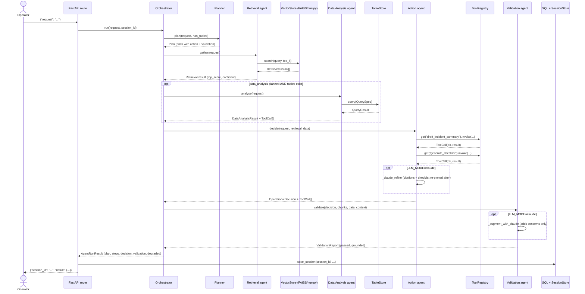
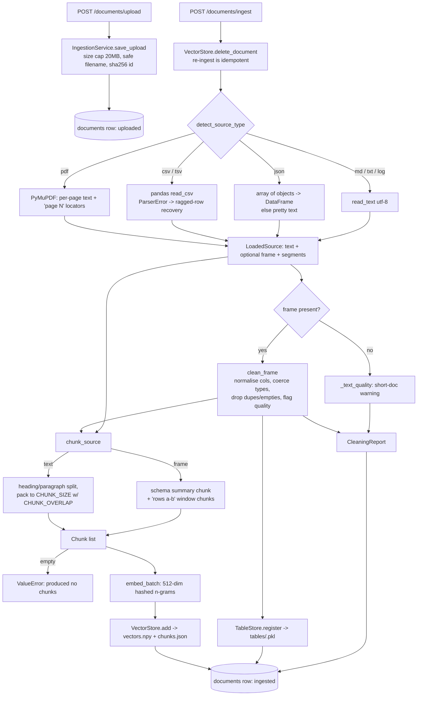

# Architecture

Technical reference for the Enterprise Agentic AI Operations Assistant. For
design rationale see [PROJECT_OVERVIEW.md](PROJECT_OVERVIEW.md); for setup see
the [README](README.md).

---

## Request lifecycle: `POST /agent/run`



Key invariants enforced by the orchestrator regardless of the plan: retrieval
runs before action; data analysis runs only when planned *and* tables exist; a
failed step sets `degraded=True` and records its error but does not abort;
validation always runs last.

---

## Ingestion pipeline



---

## Component responsibilities

| Component | Module | Responsibility |
| --- | --- | --- |
| API routes | `app/api/routes.py` | thin handlers: validate, delegate to a service, shape the response; domain errors → 4xx |
| App entry | `app/main.py` | FastAPI app, lifespan (`configure_logging`, `init_db`, warm the container), catch-all 500 handler |
| Config | `app/config.py` | the only reader of the environment; fails fast if `claude` mode lacks a key |
| Container | `app/services/container.py` | constructs every singleton once; the single DI seam |
| Loaders | `app/ingestion/loaders.py` | file bytes → `LoadedSource`; total, never swallows exceptions |
| Cleaning | `app/ingestion/cleaning.py` | normalise tabular data + emit `CleaningReport` |
| Chunking | `app/ingestion/chunking.py` | heading/paragraph packing for text; schema + row-window chunks for tables |
| Pipeline | `app/ingestion/pipeline.py` | pure transform: bytes → chunks (+ clean frame), no storage I/O |
| Ingestion service | `app/services/ingestion_service.py` | runs the pipeline, persists to vector store + table store + SQL |
| Embeddings | `app/retrieval/embeddings.py` | deterministic 512-dim hashed bag-of-n-grams |
| Vector store | `app/retrieval/vector_store.py` | FAISS `IndexFlatIP` (numpy fallback) + JSON metadata sidecar |
| Retriever | `app/retrieval/retriever.py` | top-k search, de-dupe, min-score confidence gate |
| Table store | `app/data/tables.py` | pickled cleaned frames + a validated `QuerySpec` query surface |
| Tools | `app/tools/*` | the 6 MCP-compatible tools + `ToolRegistry` |
| Planner | `app/agents/planner.py` | request → ordered `Plan` |
| Retrieval agent | `app/agents/retrieval_agent.py` | context + grounded cited `QueryAnswer` |
| Data agent | `app/agents/data_agent.py` | table metrics + anomalies |
| Action agent | `app/agents/action_agent.py` | invoke tools, assemble `OperationalDecision` |
| Validation agent | `app/agents/validation_agent.py` | grounding + completeness gate |
| Grounding | `app/agents/grounding.py` | offline content-word / trigram support score |
| Orchestrator | `app/agents/orchestrator.py` | owns control flow, per-step degradation |
| LLM client | `app/services/llm.py` | the only path to Claude; `structured()` + tenacity retries |
| Session store | `app/services/session_state.py` | Redis KV with a bounded in-memory fallback |
| Evaluation | `app/services/evaluation.py` | 7-metric harness over real runs |
| Repository / DB | `app/data/repository.py`, `database.py` | SQLAlchemy engine, `session_scope`, document/session rows |

---

## Request / response schema shapes

Domain models live in `app/schemas/`; the HTTP wrappers in `app/api/schemas.py`
are thin.

**`POST /query`** — `QueryRequest {query: str, top_k?: int}` →
`QueryResponse {session_id, answer: QueryAnswer}` where
`QueryAnswer {query, answer, citations: Citation[], supporting_chunks:
RetrievedChunk[], confident: bool, notes: str[]}` and
`Citation {marker, filename, locator, chunk_id}`
(`app/schemas/retrieval.py`).

**`POST /agent/run`** — `AgentRunRequest {request: str}` →
`AgentRunResponse {session_id, result: AgentRunResult}` where
(`app/schemas/agents.py`):

```
AgentRunResult {
  session_id, request, llm_mode, degraded: bool,
  plan: Plan { request, steps: PlanStep[]{step, agent, objective, tool?}, rationale },
  steps: AgentStep[] { agent, summary, tool_calls: ToolCall[], retrieved: RetrievedChunk[], retries, error? },
  decision: OperationalDecision? {
    request,
    incident: IncidentSummary { title, severity, summary, impact, likely_cause, evidence: Citation[] },
    recommended_next_steps: str[],
    remediation_checklist: ChecklistItem[] { order, action, owner_role, blocking },
    citations: Citation[], data_findings: DataFinding[], open_questions: str[], confidence
  },
  validation: ValidationReport { passed, grounded, issues: ValidationIssue[], unsupported_sentences, checked_claims, supported_claims }
}
```

**`POST /documents/upload`** → `UploadResponse {document: UploadedDocument, next}`.
**`POST /documents/ingest`** — `{document_id}` or `{ingest_all: true}` →
`IngestResponse {results: IngestResult[]}` (each carries a `CleaningReport`).
**`POST /evaluate`** → `EvalSummary` (7 metrics + `pass_rate` + per-case
`results`). **`GET /health`** → `HealthResponse {llm_mode, vector_backend,
session_backend, documents, chunks, tables}`. **`GET /sessions/{id}`** →
`SessionResponse` (stored SQL row, or the `SessionStore` cache as fallback).

---

## Data stores and what lives in each

| Store | Backend | Contents | Lifetime |
| --- | --- | --- | --- |
| Vector store | `vectors.npy` + `chunks.json` under `VECTOR_STORE_DIR` (FAISS index in memory) | one row per chunk: embedding + `{chunk_id, document_id, filename, source_type, locator, text}` | rebuilt on re-ingest per document |
| Table store | `tables/<name>.pkl` under `VECTOR_STORE_DIR` | one pickled *cleaned* pandas frame per CSV/JSON-array source | overwritten on re-ingest |
| SQL database | SQLite (`DATABASE_URL`, default) / Postgres in Compose | `documents` (status, path, chunk count, cleaning report JSON, table name) and `sessions` (kind, request, `llm_mode`, response JSON) | persistent |
| Session store | Redis (`REDIS_URL`) or bounded in-memory `OrderedDict` (512 items) | last `/query`, `/agent/run`, `/evaluate` payload by `session_id` | TTL 24h (Redis) / process life (memory) |

`GET /sessions/{id}` reads SQL first and falls back to the session store.

---

## Module dependency rule

```
api ──► services ──► agents ──► schemas
          │            │
          └────────────┴──► tools, retrieval, ingestion, data
```

- **Agents depend on `schemas` and on concrete collaborators
  (`Retriever`, `TableStore`, `ToolRegistry`, `LLMClient`) — never on
  `services` or `api`.** They import `app.schemas.*` and their injected
  dependencies only.
- **`container.py` is the single DI seam.** It is the one place that constructs
  `LLMClient`, `VectorStore`, `TableStore`, `Retriever`, `ToolRegistry`,
  `SessionStore`, `IngestionService`, and the `Orchestrator`. `Container.
  orchestrator()` imports `Orchestrator` *lazily* to avoid a cycle (agents
  import schemas, not services). `tests/conftest.py` overrides this one seam.
- Schemas import nothing from the app except other schemas.

---

## Extension points

**Swap the embedding backend.** Implement the `VectorStore` surface used by
callers — `add(chunks)`, `search(query, top_k) -> RetrievedChunk[]`,
`delete_document`, `clear`, `stats`, `backend`, `__len__` — backed by
sentence-transformers or Anthropic embeddings, and construct it in
`container.py`. Nothing else changes; `EMBED_DIM` is the only shared constant.

**Add a tool.** Subclass `Tool` (`app/tools/base.py`) with `name`,
`description`, JSON-Schema `input_schema`, and `run(arguments) -> dict`; add one
line to the `tools` list in `ToolRegistry.__init__`. It is immediately
available to the Action agent, to Claude tool-use (`to_anthropic()`), and to the
MCP server (`to_mcp()`).

```python
class PingHostsTool(Tool):
    name = "ping_hosts"
    description = "Check reachability of named hosts."
    input_schema = {"type": "object", "properties": {"hosts": {"type": "array",
        "items": {"type": "string"}}}, "required": ["hosts"], "additionalProperties": False}

    def run(self, arguments: dict) -> dict:
        return {"results": [{"host": h, "ok": True} for h in arguments["hosts"]]}
```

**Add an agent.** Subclass `Agent` (`app/agents/base.py`), give it a `name` and
a deterministic method plus an optional `self.uses_claude` branch that calls
`self.with_retry(lambda: self.llm.structured(...))` and falls back on `None`.
Add it to `AgentName`, construct it in `Orchestrator.__init__`, and slot a
`try/except` step into `Orchestrator.run()` that records an `AgentStep` and sets
`degraded=True` on failure. If it should appear in plans, add a `PlanStep` for
it in the Planner's mock path and keep `_sanitise` aware of it.
