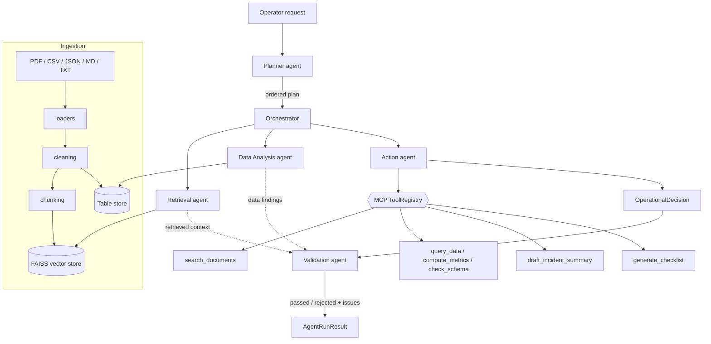

# Enterprise Agentic AI Operations Assistant

A multi-agent RAG system that ingests messy enterprise data (PDF, CSV, JSON,
Markdown, text), retrieves relevant context, runs a small team of specialised
agents over MCP-compatible tools, and produces a **grounded operational
decision** — an incident summary, recommended next steps, and a remediation
checklist — with citations back to the source material.

It runs fully offline in **mock mode** (no API key, deterministic) and switches
to **Claude mode** with a single environment variable.

> Personal portfolio project. The sample data is synthetic. No real company,
> customer, or production system is involved.

---

## Problem statement

On-call and platform teams answer the same question under pressure again and
again: *"something is broken — what does our own documentation and data say we
should do?"* The relevant knowledge is scattered across runbooks, postmortems,
scratch notes, incident logs, and metrics exports, much of it inconsistent or
half-cleaned. This project builds an assistant that:

1. Ingests those messy sources and normalises them.
2. Retrieves the passages and rows that actually bear on the question.
3. Uses specialised agents to plan, search, analyse data, and draft a decision.
4. **Refuses to state anything it can't ground** in retrieved context, and says
   so explicitly when the corpus doesn't cover the question.

## Features

- **Ingestion** for PDF (PyMuPDF text layer, with an optional Tesseract OCR
  fallback for scanned pages), CSV/TSV (including ragged rows), JSON (objects and
  record arrays), Markdown, and plain text.
- **Cleaning & validation**: column-name normalisation, type coercion, null and
  duplicate detection, outlier / sentinel-value flagging, with a structured
  `CleaningReport`.
- **RAG** over documents *and* structured data, using a deterministic offline
  embedding (hashed n-grams + character trigrams) and FAISS (numpy fallback).
- **Five agents** — Planner, Retrieval, Data Analysis, Action, Validation —
  coordinated by an orchestrator that owns control flow and degrades gracefully
  on partial failure.
- **MCP-compatible tools**: `search_documents`, `query_data`, `compute_metrics`,
  `check_schema`, `draft_incident_summary`, `generate_checklist`. The same
  `ToolRegistry` backs the Action agent and an optional stdio MCP server.
- **Structured outputs** (Pydantic models) with inline citation markers.
- **Guardrails**: the Validation agent checks every factual claim against the
  retrieved context, requires all output fields, and rejects runs whose claims
  are largely unsupported.
- **Retries**: LLM transport errors retry with backoff; malformed JSON output is
  repaired once with the parser error fed back, then fails loudly.
- **Evaluation harness** that computes retrieval relevance, citation presence,
  tool-selection accuracy, structured-output validity, groundedness,
  missing-info handling, and response consistency from the sample dataset.

## Architecture diagram



See [ARCHITECTURE.md](ARCHITECTURE.md) for the RAG and tool-calling flows in
detail, and [PROJECT_OVERVIEW.md](PROJECT_OVERVIEW.md) for the design rationale.

---

## Local setup

Requires **Python 3.11+**. The commands below use [uv](https://docs.astral.sh/uv/);
plain `python -m venv` + `pip install -e ".[dev]"` works too.

```bash
# 1. install uv (skip if you have it)
curl -LsSf https://astral.sh/uv/install.sh | sh

# 2. clone and enter
git clone https://github.com/ShathishWarmaS/Enterprise-Agentic-AI-Operations-Assistant.git
cd Enterprise-Agentic-AI-Operations-Assistant

# 3. create the environment
uv venv --python 3.11
uv pip install -e ".[dev]"          # add ,ocr for scanned-PDF support (needs tesseract)

# 4. configure (all defaults work offline)
cp .env.example .env

# 5. build the sample corpus (PDF is generated locally)
uv run python scripts/make_sample_pdf.py
uv run python scripts/seed.py

# 6. run the API
uv run uvicorn app.main:app --reload
# -> http://localhost:8000/docs
```

In a second terminal, run the UI:

```bash
uv run streamlit run frontend/streamlit_app.py
# -> http://localhost:8501
```

## Docker setup

Brings up the API, the Streamlit UI, Postgres, and Redis, and seeds the corpus:

```bash
docker compose up --build
```

- API:      http://localhost:8000/docs
- Frontend: http://localhost:8501

```bash
docker compose down -v   # stop and wipe volumes
```

To use Claude mode with Docker:

```bash
LLM_MODE=claude ANTHROPIC_API_KEY=sk-ant-... docker compose up --build
```

## Environment variables

All are optional; every one has a working default for offline use. See
[.env.example](.env.example).

| Variable | Default | Purpose |
| --- | --- | --- |
| `LLM_MODE` | `mock` | `mock` (offline, deterministic) or `claude` |
| `ANTHROPIC_API_KEY` | — | required when `LLM_MODE=claude` |
| `ANTHROPIC_MODEL` | `claude-sonnet-4-20250514` | model id for Claude mode |
| `ANTHROPIC_MAX_TOKENS` | `1024` | per-response cap |
| `DATABASE_URL` | `sqlite:///./storage/app.sqlite3` | any SQLAlchemy URL (Compose uses Postgres) |
| `VECTOR_STORE_DIR` | `./storage/vector` | FAISS index + chunk metadata |
| `UPLOAD_DIR` | `./storage/uploads` | stored source files |
| `REDIS_URL` | — | optional; falls back to an in-process store |
| `PDF_OCR_FALLBACK` | `false` | OCR scanned PDF pages (needs `.[ocr]` extra + `tesseract` binary) |
| `CHUNK_SIZE` / `CHUNK_OVERLAP` | `800` / `120` | chunking |
| `RETRIEVAL_TOP_K` | `5` | chunks per query |
| `RETRIEVAL_MIN_SCORE` | `0.22` | below this, retrieval is "not confident" |
| `API_HOST` / `API_PORT` | `0.0.0.0` / `8000` | uvicorn bind |
| `LOG_LEVEL` | `INFO` | standard logging level |

## API usage

| Method & path | Purpose |
| --- | --- |
| `GET /health` | mode, backends, corpus size |
| `POST /documents/upload` | multipart file upload; returns a `document_id` |
| `POST /documents/ingest` | `{"document_id": "..."}` or `{"ingest_all": true}` |
| `POST /query` | `{"query": "...", "top_k": 5}` → grounded answer + citations |
| `POST /agent/run` | `{"request": "..."}` → plan, agent steps, decision, validation |
| `POST /evaluate` | `{}` or `{"cases_path": "..."}` → metric summary |
| `GET /sessions/{session_id}` | stored result of a prior `/query`, `/agent/run`, or `/evaluate` |

### Sample curl commands

```bash
# health
curl -s http://localhost:8000/health | jq

# upload + ingest a file
DOC=$(curl -s -F "file=@sample_data/runbook_payment_service.md" \
  http://localhost:8000/documents/upload | jq -r .document.document_id)
curl -s -X POST http://localhost:8000/documents/ingest \
  -H 'content-type: application/json' -d "{\"document_id\": \"$DOC\"}" | jq

# grounded Q&A
curl -s -X POST http://localhost:8000/query \
  -H 'content-type: application/json' \
  -d '{"query": "What most often causes a 5xx spike on payment-service?"}' | jq

# full multi-agent run
curl -s -X POST http://localhost:8000/agent/run \
  -H 'content-type: application/json' \
  -d '{"request": "payment-service is throwing 5xx after a deploy 10 minutes ago; give me an incident summary, next steps, and a checklist"}' | jq

# evaluation
curl -s -X POST http://localhost:8000/evaluate -H 'content-type: application/json' -d '{}' | jq

# fetch a stored session
curl -s http://localhost:8000/sessions/<session_id> | jq
```

## Streamlit usage

`uv run streamlit run frontend/streamlit_app.py` opens a three-tab UI:

- **Ask** — grounded Q&A with sources.
- **Investigate** — the full agent run: plan, validation verdict, incident
  summary, next steps, checklist, open questions, citations.
- **Evaluate** — runs the harness and shows the metric tiles + per-case table.

The sidebar shows corpus health and lets you upload a document or re-ingest the
sample set. Set `API_URL` if the API is not on `localhost:8000`.

## Mock mode vs Claude mode

**Mock mode (`LLM_MODE=mock`, default)** makes no network calls. Agents run
deterministic Python: the Planner uses keyword routing, the Retrieval agent
produces an extractive cited answer, the Action agent assembles the decision
from retrieved sentences and tool output, and Validation runs the same
overlap-based grounding check it always does. This keeps development and the
evaluation harness fully reproducible.

**Claude mode (`LLM_MODE=claude`)** additionally calls the Anthropic API:

```bash
export LLM_MODE=claude
export ANTHROPIC_API_KEY=sk-ant-...
uv run uvicorn app.main:app --reload
```

In Claude mode the Planner, Retrieval, Action, and Validation agents ask Claude
for structured JSON (via `LLMClient.structured`, which validates against the
Pydantic schema and repairs once on malformed output). Citations and the
remediation checklist are still produced by the deterministic tools, and the
deterministic Validation pass still owns the final pass/fail decision — Claude
can add concerns, not remove them. If Claude is unavailable the agent falls back
to its mock path and records that in the run.

## Test commands

```bash
uv run pytest -q                       # full suite
uv run pytest -q --cov=app             # with coverage
uv run pytest tests/test_agents.py -q  # one module

# everything CI runs, locally:
uv run ruff check .
uv run black --check .
uv run mypy app
bash scripts/check.sh
```

## Evaluation

```bash
uv run python scripts/seed.py
uv run python scripts/run_eval.py            # human-readable report
uv run python scripts/run_eval.py --json     # machine-readable
```

The harness runs each labelled case in [`sample_data/eval_cases.json`](sample_data/eval_cases.json)
through the real retrieval / agent code and computes each metric from the
output. Scores are **not** hard-coded. In mock mode the run is deterministic, so
`response_consistency` is 1.0 by construction — that is a property of mock mode,
not a claim about Claude mode.

## MCP server

```bash
uv pip install mcp
uv run python scripts/mcp_server.py
```

Exposes the same six tools over stdio MCP, backed by the same `ToolRegistry` the
Action agent uses.

## Known limitations

- The offline embedding is lexical (hashed n-grams + character trigrams). It
  handles wording variants but has no real semantic understanding — synonyms and
  paraphrase can be missed. The `VectorStore` interface is small so a neural
  encoder can be swapped in.
- Mock-mode answers are extractive: they quote source sentences rather than
  synthesising prose. This is intentional (it keeps grounding trivial to verify)
  but reads less fluently than Claude mode.
- Groundedness is checked by content-word / trigram overlap, not an NLI model.
  It is tuned to be conservative (reject weak-but-true over accept fabricated).
- The evaluation set is small (7 cases) and illustrative, not a benchmark.
- Scanned/image-only PDFs need `PDF_OCR_FALLBACK=true`, the `.[ocr]` extra, and a
  Tesseract install; without them such a PDF is rejected with a clear error
  rather than ingested empty. OCR accuracy is Tesseract's, not tuned here.
- No authentication, rate limiting, or multi-tenant isolation — out of scope for
  a portfolio project (see PROJECT_OVERVIEW.md → production trade-offs).

## Future improvements

- Pluggable neural embeddings (sentence-transformers / Anthropic embeddings)
  behind the existing `VectorStore` seam.
- Streaming agent runs over Server-Sent Events.
- A larger, versioned evaluation set with regression tracking.
- Async ingestion queue (Redis Streams) for large document batches.
- Per-source access control and PII redaction in the cleaning stage.

## Publishing to GitHub

This repo is already initialised. To push it to a fresh GitHub repository:

```bash
git add .
git commit -m "Enterprise Agentic AI Operations Assistant"
git branch -M main
git remote add origin https://github.com/ShathishWarmaS/Enterprise-Agentic-AI-Operations-Assistant.git
git push -u origin main
```

If the remote already has a commit (e.g. an initial README), rebase onto it
first:

```bash
git pull --rebase origin main
git push -u origin main
```

## Repository layout

```
enterprise-agentic-ai/
├── app/
│   ├── main.py              FastAPI app + lifespan + error handler
│   ├── config.py            env-driven settings (pydantic-settings)
│   ├── api/                 routes + request/response schemas
│   ├── agents/              planner, retrieval, data, action, validation, orchestrator, grounding
│   ├── tools/               MCP-compatible tool contract + implementations + registry
│   ├── ingestion/           loaders, cleaning, chunking, pipeline
│   ├── retrieval/           embeddings, FAISS vector store, retriever
│   ├── data/                SQLAlchemy models, repository, safe table-query store
│   ├── services/            LLM client, container (DI), ingestion service, session state, evaluation
│   └── prompts/             system prompts (Claude mode only)
├── frontend/streamlit_app.py
├── tests/                   ingestion, retrieval, tools, llm, agents, api, evaluation
├── sample_data/             synthetic runbooks/postmortems/logs + eval_cases.json
├── scripts/                 seed, run_eval, make_sample_pdf, mcp_server, check.sh
├── Dockerfile, docker-compose.yml
├── pyproject.toml, .env.example
└── PROJECT_OVERVIEW.md, ARCHITECTURE.md, RESUME_BULLETS.md
```
